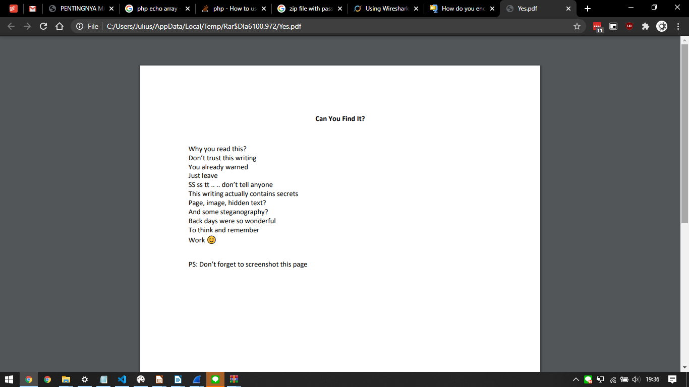

# Jarkom_Modul1_Lapres_E1

## A.	Display Filter
1. Sebutkan webserver yang digunakan pada "testing.mekanis.me"!

    Cari IP dari domain testing.mekanis.me

    `frame contains "testing.mekanis.me"`

    

    find response from website, karena tidak bisa pakai nama websitenya, gunakan IP dari website yang sudah diketahui dari hasil wireshark diatas

    `ip.src_host == "157.245.50.224" and http.response`

    
    
    Hasil ada di field server dari HTTP header
    
    nginx/1.14.0 (Ubuntu)

2.	Simpan gambar "Tim_Kunjungan_Kerja_BAKN_DPR_RI_ke_Sukabumi141436.jpg"!

    `frame contains "Sukabumi141436"`
    
    
    
    export http
    
    
    
    Search nama filenya
    
    
    
    export
    
    

3.	Cari username dan password ketika login di "ppid.dpr.go.id"!

    `http.host == "ppid.dpr.go.id" and http.request.method == "POST"`
    
    
    
    user: 10pemuda
    
    password: guncangdunia

4.	Temukan paket dari web-web yang menggunakan basic authentication method!

    `http.authbasic`
    
    
    
    follow http stream untuk check web nya
    
    
    
    webiste testing.mekanis.me

5.	Ikuti perintah di aku.pengen.pw! Username dan password bisa didapatkan dari file .pcapng!

    `http.host == "aku.pengen.pw"`
    
    
    
    
    user: kakakgamtenk
    
    pass: hartatahtabermuda
    
    
    
    Urutan T568B
    1. Putih - Oranye
    2. Oranye
    3. Putih - Hijau
    4. Biru
    5. Putih - Biru
    6. Hijau
    7. Putih - Coklat
    8. Coklat

6.	Seseorang menyimpan file zip melalui FTP dengan nama "Answer.zip". Simpan dan Buka file "Open This.pdf" di Answer.zip. Untuk mendapatkan password zipnya, temukan dalam file zipkey.txt (passwordnya adalah isi dari file txt tersebut).

    `ftp-data and ftp-data.command contains "Answer.zip"`
    
    
    
    follow tcp stream, raw, save as Answer.zip
    
    
    
    **Finding password**
    
    `ftp-data and ftp-data.command contains "txt"`
    
    
    
    zipkey.txt
    
    hey997400323051
    
    
    
    

7.	Ada 500 file zip yang disimpan ke FTP Server dengan nama 1.zip, 2.zip, ..., 500.zip. Salah satunya berisi pdf yang berisi puisi. Simpan dan Buka file pdf tersebut. Your Super Mega Ultra Rare Hint = nama pdf-nya "Yes.pdf"

    `ftp-data and frame contains "Yes.pdf"`
    
    
    
    follow tcp stream, as raw, save as namaFile.zip
    
    
    
    

8.	Cari objek apa saja yang didownload (RETR) dari koneksi FTP dengan Microsoft FTP Service!
    
    `ftp.request.command == "RETR" `
    
    
    
    Host yang mana yang microsoft?
    
    Gunakan follow ftp stream
    
    
    
    atau cari `ip.addr` ke sumber, pasti host diberitahu di awal
    
    `ip.addr == 198.246.117.106`
    
    

9.	Cari username dan password ketika login FTP pada localhost!

    `ftp.request.command contains "USER" or ftp.request.command contains "PASS"`
    
    

10.	Cari file .pdf di wireshark lalu download dan buka file tersebut! clue: "25 50 44 46" 

    `frame contains "pdf"`
    
    
    
    
    
    follow tcp stream, raw, save as test.pdf
    
    
    
    

## B. Capture Filter
1.	Filter sehingga wireshark hanya mengambil paket yang mengandung port 21!

    `port 21`
    
    

2.	Filter sehingga wireshark hanya mengambil paket yang berasal dari port 80!

    `src port 80`
    
    

3.	Filter sehingga wireshark hanya menampilkan paket yang menuju port 443!

    `dst port 443`
    
    

4.	Filter sehingga wireshark hanya mengambil paket yang berasal dari ip kalian!

    `src host 192.168.1.4`
    
    

5.	Filter sehingga wireshark hanya mengambil paket yang tujuannya ke monta.if.its.ac.id!
 
    `host monta.if.its.ac.id`
    
    

